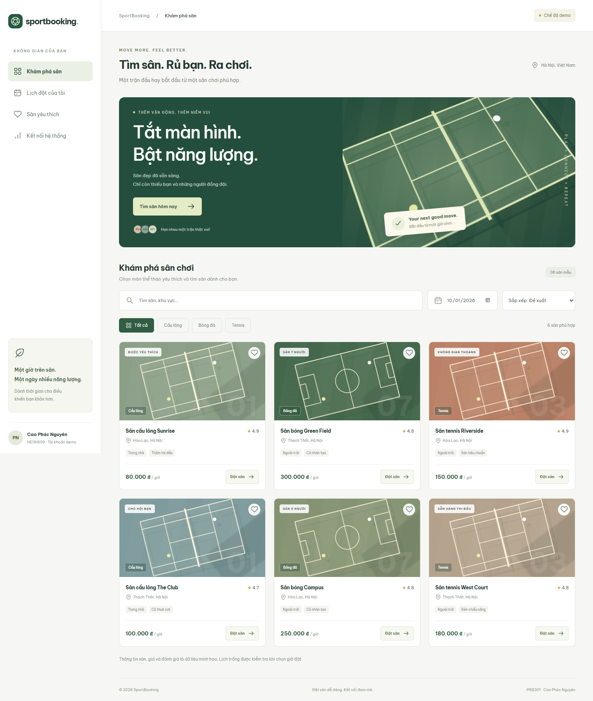
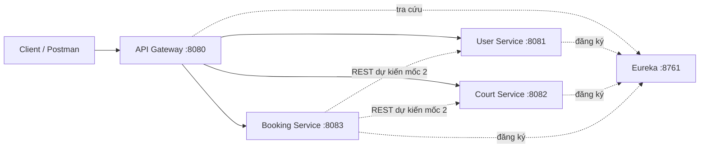

# SportBooking — Quản lý và đặt sân thể thao

Bài làm MSS301: xây dựng hệ thống đặt sân thể thao theo kiến trúc Microservices, sử dụng Spring Boot, Spring Cloud và Docker.

Repository GitHub: [nguyennn0411/MSS_301_MyProject](https://github.com/nguyennn0411/MSS_301_MyProject).

**Giai đoạn hiện tại: mốc 1 — phân tích, thiết kế và khởi tạo skeleton (nội dung Asm 1.1).**
Đã có 5 ứng dụng Spring Boot, cấu hình Eureka, route Gateway và API kiểm tra kết nối.
Chưa có CRUD nghiệp vụ, database, đăng nhập, gọi REST giữa các service nghiệp vụ hoặc Docker Compose.

**Bổ sung giao diện:** React JS + Vite trong `frontend/`, gồm khám phá sân, yêu thích,
đặt/hủy lịch demo trên trình duyệt và kiểm tra kết nối Gateway.
Chức năng đặt sân chưa kết nối API nghiệp vụ. Xem [hướng dẫn frontend](frontend/README.md).

```powershell
cd frontend
npm ci
npm run dev
```

Mở http://127.0.0.1:5173. Kiểm tra frontend bằng `npm run lint`, `npm test`, `npm run build`.



> Đề yêu cầu Project và Assignment khác đề tài. SportBooking đang là đề tài đã chọn cho Project;
> bộ khung này bám checklist Asm 1.1 được cung cấp. Không dùng cùng đề tài cho cả hai bài.

## Thành viên

| Họ tên | MSSV | Vai trò |
|---|---|---|
| Cao Phúc Nguyên | HE191659 | Phân tích, phát triển backend, tích hợp, kiểm thử và tài liệu |

Phân công theo nhóm hiện có 1 thành viên. Xem [phân công và kế hoạch](docs/04-team-and-plan.md).

## Mục tiêu và kiến trúc

Khách xem sân và đặt sân theo thời gian. Hệ thống dự kiến kiểm tra trùng lịch, tính tiền, lưu lịch sử và hỗ trợ hủy đặt.



Mỗi ứng dụng chạy bằng một tiến trình riêng. Các service nghiệp vụ sẽ sở hữu database riêng ở mốc 2.
Maven multi-module chỉ dùng để quản lý source và build, không gộp các service thành một ứng dụng.

## Công nghệ

- Java 21; Spring Boot 4.0.7; Spring Cloud 2025.1.2.
- Eureka Server/Client, Spring Cloud Gateway WebFlux, LoadBalancer, Actuator.
- Maven 3.9.11 qua Maven Wrapper.
- PostgreSQL và Docker Compose: dự kiến các mốc sau.

Cặp phiên bản được chọn theo [bảng tương thích Spring Cloud](https://spring.io/projects/spring-cloud/).

## Cấu trúc repository

```text
.
├── docs/
│   ├── 01-problem-analysis.md
│   ├── 02-monolithic-vs-microservices.md
│   ├── 03-system-architecture.md
│   ├── 04-team-and-plan.md
│   ├── 05-local-run.md
│   └── 06-milestone-1-checklist.md
├── discovery-server/
├── api-gateway/
├── services/
│   ├── user-service/
│   ├── court-service/
│   └── booking-service/
├── .mvn/wrapper/
├── mvnw
├── mvnw.cmd
└── pom.xml
```

Tên user-service, court-service, booking-service thay cho service-a, service-b, service-c trong đề.

## Build và chạy nhanh

Yêu cầu JDK 21, JAVA_HOME trỏ đến JDK và Internet để Maven tải dependency ở lần đầu.

Windows PowerShell, chạy tại thư mục gốc:

```powershell
.\mvnw.cmd clean verify
```

Mở 5 terminal tại thư mục gốc và chạy mỗi lệnh trong một terminal (Eureka trước):

```powershell
java -jar discovery-server/target/discovery-server-0.0.1-SNAPSHOT.jar
java -jar services/user-service/target/user-service-0.0.1-SNAPSHOT.jar
java -jar services/court-service/target/court-service-0.0.1-SNAPSHOT.jar
java -jar services/booking-service/target/booking-service-0.0.1-SNAPSHOT.jar
java -jar api-gateway/target/api-gateway-0.0.1-SNAPSHOT.jar
```

Linux/macOS: chạy `chmod +x mvnw`, build bằng `./mvnw clean verify`; các lệnh `java -jar` giữ nguyên.

Chờ các service đăng ký Eureka và Gateway cập nhật danh sách (thường khoảng 30–90 giây), sau đó:

```powershell
Invoke-RestMethod http://localhost:8080/api/users/status
Invoke-RestMethod http://localhost:8080/api/courts/status
Invoke-RestMethod http://localhost:8080/api/bookings/status
```

Kết quả mỗi API gồm `service`, `status: UP`, `milestone: 1`.
Dashboard Eureka: [localhost:8761](http://localhost:8761).
Hướng dẫn đầy đủ và xử lý lỗi: [chạy local](docs/05-local-run.md).

## Tài liệu nộp mốc 1

1. [Phân tích bài toán và phạm vi](docs/01-problem-analysis.md).
2. [So sánh Monolithic và Microservices](docs/02-monolithic-vs-microservices.md).
3. [Sơ đồ kiến trúc, dữ liệu và luồng request](docs/03-system-architecture.md).
4. [Phân công, tiến độ và quy trình Git](docs/04-team-and-plan.md).
5. [Checklist nộp bài và đưa lên GitHub](docs/06-milestone-1-checklist.md).

Đề có hai bộ mốc commit: tuần 5–7–8 trong từng phần và tuần 3–6–9 ở phần cuối.
Cần xác nhận với giảng viên; chưa gán ngày hạn nộp khi chưa biết lịch học.
