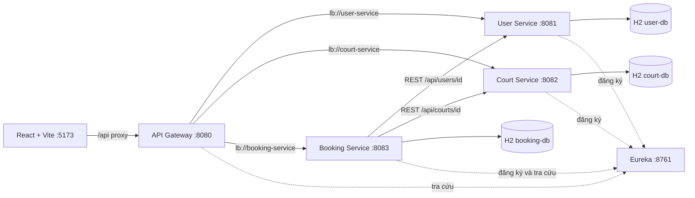
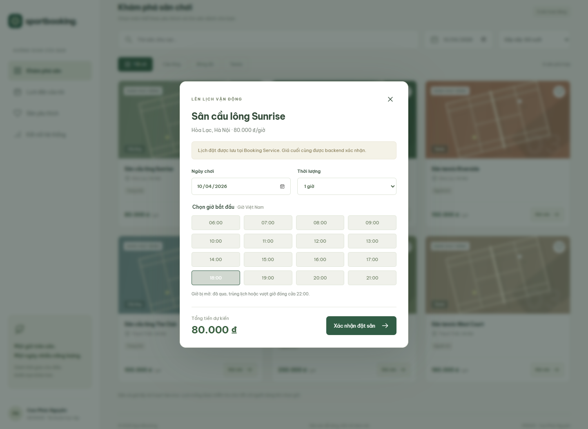

# SportBooking — Quản lý và đặt sân thể thao

MSS301 · **Cao Phúc Nguyên — HE191659** · Nhóm 1 thành viên.

Repository: [nguyennn0411/MSS_301_MyProject](https://github.com/nguyennn0411/MSS_301_MyProject).

## Tiến độ

- **Mốc 1 (Asm 1.1):** phân tích, kiến trúc, phân công và skeleton — hoàn thành.
- **Mốc 2 (Asm 1.2):** ba REST microservices, Controller–Service–Repository, Eureka,
  Gateway, REST liên service, database riêng và giao diện nối API — xem [bàn giao mốc 2](docs/08-milestone-2.md).
- **Mốc 3:** Dockerfile và Docker Compose — chưa triển khai.

SportBooking là đề tài Project đã chọn. Theo đề, Assignment phải dùng đề tài khác;
repository này bám các mốc kỹ thuật đã cung cấp, không thay thế việc xác nhận đề tài với giảng viên.
Đề có hai bộ hạn commit 5–7–8 và 3–6–9; cần xác nhận lịch chính thức.

## Chức năng hiện có

- User Service: tạo, đọc, cập nhật hồ sơ và trạng thái người dùng.
- Court Service: tạo, đọc, cập nhật sân, giá và trạng thái hoạt động.
- Booking Service: đặt sân, kiểm tra user/court qua REST, tính tiền từ giá backend,
  lưu giá tại thời điểm đặt, lịch sử, chi tiết, lịch bận và hủy.
- Chặn trùng giờ ở database, kể cả các request đồng thời; giải phóng giờ khi hủy.
- React: tìm/lọc sân, yêu thích, chọn giờ, đặt/hủy qua API, tải lại lịch từ database.
- Giao diện dùng tài khoản học tập user-nguyen. Chưa có đăng nhập/phân quyền hoặc thanh toán.

## Kiến trúc



Java 21 · Spring Boot 4.0.7 · Spring Cloud 2025.1.2 · Spring JDBC · H2 file · React 19 · Vite 8.
Theo [bảng tương thích Spring Cloud](https://spring.io/projects/spring-cloud/).
Maven multi-module quản lý build; mỗi ứng dụng có JAR và tiến trình riêng.
Mỗi service chỉ truy cập database của mình.

## Chạy local nhanh (PowerShell)

Cần JDK 21 và JAVA_HOME, Node.js 22.12+ hoặc 24, Internet cho lần tải dependency đầu.

```powershell
# Tại root repository
.\mvnw.cmd clean verify
.\scripts\start-local.ps1
```

Script chạy 5 tiến trình nền, ghi log vào .run và chờ Gateway sẵn sàng (tối đa 180 giây).

Terminal khác:

```powershell
cd frontend
npm ci
npm run dev
```

- Giao diện: http://127.0.0.1:5173
- Eureka: http://localhost:8761
- Gateway: http://localhost:8080/api/courts

Dừng backend: ` .\scripts\stop-local.ps1 `; dừng Vite bằng Ctrl+C.
Chi tiết, chạy từng JAR và xử lý lỗi: [hướng dẫn local](docs/05-local-run.md).

## Dữ liệu

H2 lưu tại data/user-db.mv.db, data/court-db.mv.db, data/booking-db.mv.db khi chạy từ root.
Khởi động lại vẫn giữ dữ liệu. Dữ liệu seed gồm user-nguyen và 6 sân, chỉ thêm nếu chưa tồn tại.
Không reset hồ sơ/giá sân khi restart. Dữ liệu và log bị loại khỏi Git.

Mốc này chọn H2 file để demo local không cần cài database; PostgreSQL là hướng triển khai sau.
Mỗi H2 file chỉ mở bởi một tiến trình service trong cấu hình hiện tại.

## Kiểm thử

```powershell
.\mvnw.cmd test
node scripts/test-api.mjs
npm --prefix frontend test
npm --prefix frontend run lint
npm --prefix frontend run build
```

Test API yêu cầu backend đã sẵn sàng; tạo dữ liệu test riêng, rồi hủy lịch và ngừng hoạt động user/sân test.
Chi tiết bằng chứng và giới hạn: [mốc 2](docs/08-milestone-2.md).

## Tài liệu

- [Phân tích bài toán](docs/01-problem-analysis.md)
- [Monolithic vs Microservices](docs/02-monolithic-vs-microservices.md)
- [Thiết kế kiến trúc ban đầu](docs/03-system-architecture.md)
- [Phân công nhóm](docs/04-team-and-plan.md)
- [Hướng dẫn local](docs/05-local-run.md)
- [Checklist mốc 1](docs/06-milestone-1-checklist.md)
- [Biên bản kiểm tra mốc 1](docs/07-validation.md)
- [Bàn giao mốc 2 và API](docs/08-milestone-2.md)
- [Luồng request hiện tại](docs/09-request-flow.md)
- [Giao diện](frontend/README.md)


