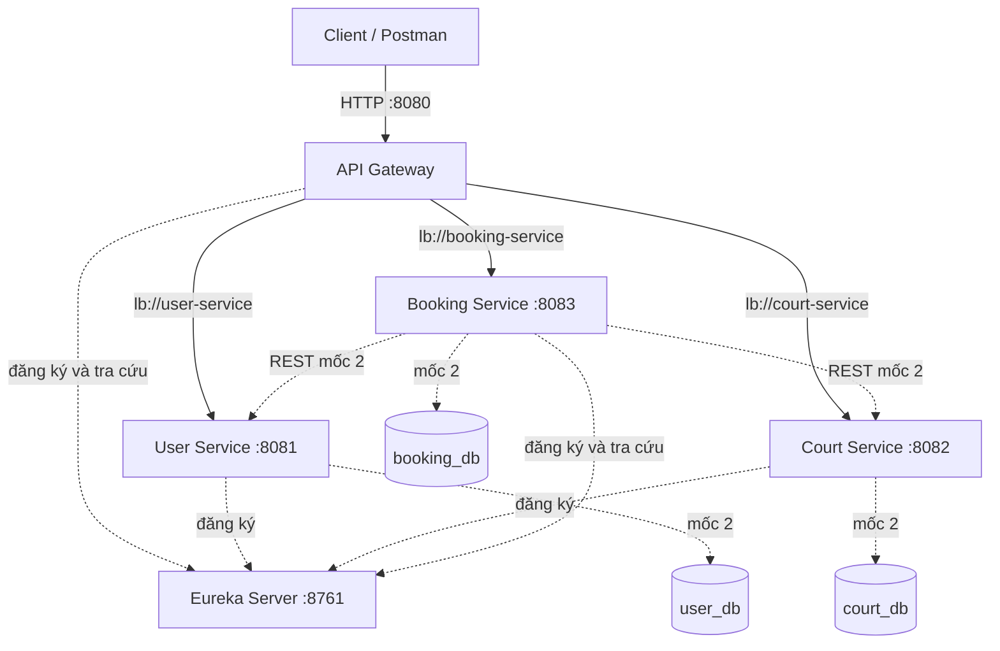
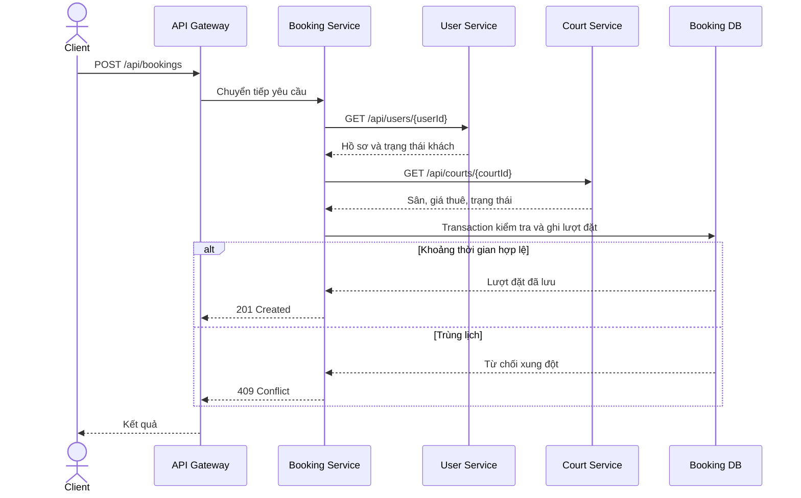
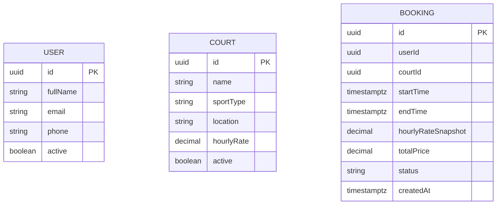

> Tài liệu thiết kế ban đầu ở mốc 1. Hiện trạng mốc 2, điều chỉnh H2 file và API đã triển khai: [bàn giao mốc 2](08-milestone-2.md), [luồng request](09-request-flow.md).

# 03. Thiết kế kiến trúc hệ thống

## 1. Sơ đồ tổng thể

Database và REST giữa các service nghiệp vụ là thiết kế mốc 2.
Gateway, Eureka và các endpoint status đã có cấu hình/source trong mốc 1.

## 2. Vai trò các thành phần

- **API Gateway:** cổng vào tập trung, ánh xạ URL đến service, dùng Spring Cloud LoadBalancer với URI lb://.
  Gateway dùng WebFlux; không đặt logic đặt sân hoặc repository ở đây.
- **Eureka Server:** lưu danh sách instance và địa chỉ service. Eureka không chuyển tiếp request nghiệp vụ.
- **User Service:** sở hữu hồ sơ khách.
- **Court Service:** sở hữu danh mục sân, giá và trạng thái hoạt động.
- **Booking Service:** sở hữu lịch đặt và quyết định xung đột thời gian.
- **Database riêng:** mỗi service chỉ truy cập dữ liệu mình sở hữu; userId/courtId trong Booking là tham chiếu logic,
  không phải foreign key xuyên database.

## 3. Ánh xạ route đang cấu hình

| Gateway nhận | Đích discovery | Cổng mặc định |
|---|---|---|
| /api/users/** | lb://user-service | 8081 |
| /api/courts/** | lb://court-service | 8082 |
| /api/bookings/** | lb://booking-service | 8083 |

Giữ nguyên đường dẫn khi chuyển tiếp, vì controller của từng service cũng có tiền tố /api tương ứng.
Gateway không chứa URL cố định localhost:8081/8082/8083 trong route.
Địa chỉ Eureka mặc định là http://localhost:8761/eureka/ và có thể đổi bằng EUREKA_SERVER_URL.

## 4. Luồng request đang có ở mốc 1

1. Client gọi GET http://localhost:8080/api/courts/status.
2. Gateway khớp route court-service.
3. LoadBalancer chọn một instance từ danh sách do Eureka cung cấp.
4. Court Service trả JSON với service=court-service, status=UP, milestone=1.
5. Gateway trả response cho client.

Endpoint status chỉ kiểm tra ứng dụng và đường đi request; không chứng minh nghiệp vụ đặt sân hoặc database hoạt động.

## 5. Luồng đặt sân dự kiến mốc 2

Nếu khách/sân không tồn tại hoặc không hoạt động, dừng trước bước ghi dữ liệu.
Nếu User/Court không sẵn sàng, trả 503 và không tạo lượt đặt.
REST nội bộ dự kiến dùng tên service qua discovery; không cần quay lại Gateway cho mỗi lời gọi nội bộ.

## 6. Thiết kế dữ liệu dự kiến

Ba thực thể thuộc ba database. Không vẽ liên kết khóa ngoại giữa các database để tránh hiểu nhầm rằng service dùng chung schema.

## 7. Định hướng Docker ở mốc 3

Mỗi ứng dụng có Dockerfile; Compose khởi chạy Eureka, Gateway, ba service và PostgreSQL.
Trong container, EUREKA_SERVER_URL sẽ dùng hostname discovery-server thay vì localhost.
Các service truy cập database qua hostname trong Docker network, có volume lưu dữ liệu.
Cần healthcheck và chờ dependency sẵn sàng; chỉ depends_on không tự bảo đảm ứng dụng đã sẵn sàng.
