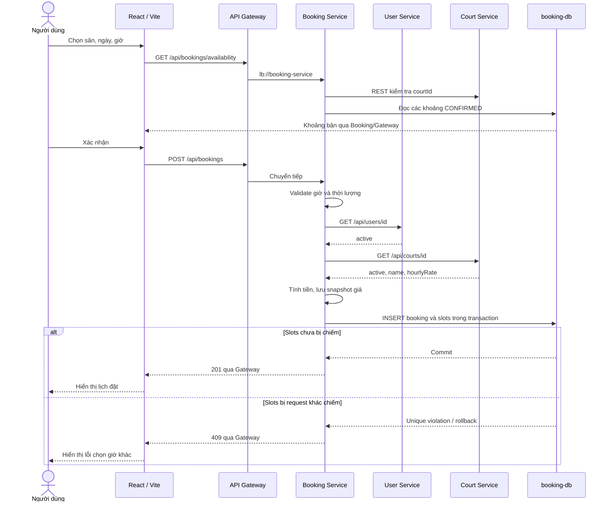

# 09. Luồng request đã triển khai

## Đặt sân

Eureka không truyền request nghiệp vụ. Gateway và Booking dùng registry đã cache để tìm instance.
RestClient có connect timeout 3s/read timeout 5s, không retry POST.
Eureka dùng RestClient.Builder thường; REST nghiệp vụ dùng builder @LoadBalanced riêng để tránh
nhầm hostname localhost của Eureka thành tên service.

## Hủy và lưu bền

PATCH /api/bookings/id/cancel → Gateway → Booking:
SELECT FOR UPDATE khóa dòng booking; kiểm tra trạng thái và giờ bắt đầu;
UPDATE CANCELLED và DELETE slots trong cùng transaction.
Hủy lặp trả booking đã hủy; lượt đã bắt đầu trả 409.
Lượt mới có thể đặt giờ đã hủy sau khi transaction hoàn tất.

H2 ghi dữ liệu vào file riêng mỗi service. Restart đọc lại cùng file.
schema.sql chỉ CREATE IF NOT EXISTS, seed dùng INSERT ... WHERE NOT EXISTS, không reset dữ liệu đã sửa.

## Khi phụ thuộc lỗi

User/Court trả 404 → Booking trả 404, không ghi booking.
User/Court ngừng hoạt động → 409.
Timeout, mất instance hoặc REST lỗi → 503, transaction không ghi lịch.
Frontend hiển thị lỗi, không tạo booking giả trong trình duyệt.
